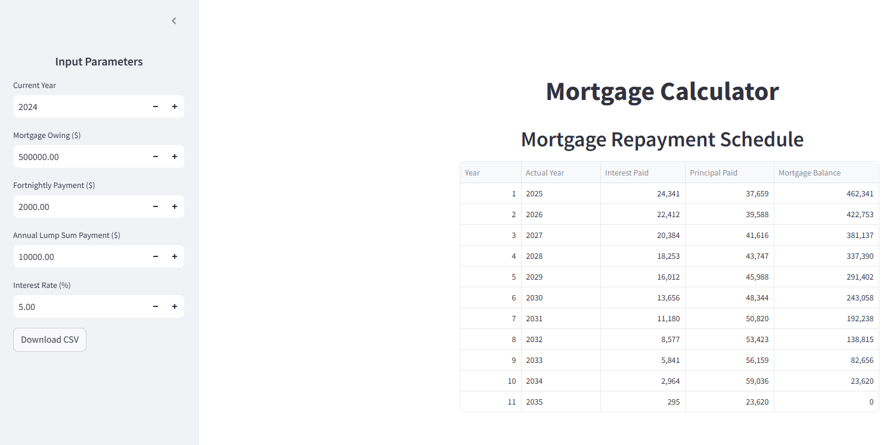
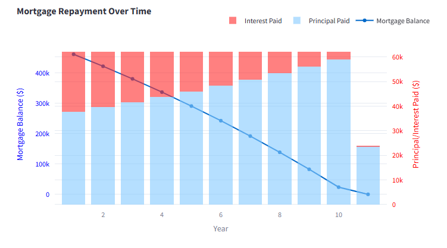

# 🏡 Financial Freedom App


[](https://ko-fi.com/I2I7181CR0)

## 📖 Overview

The **Financial Freedom App** is an interactive tool designed to help users manage and visualize their mortgage repayment schedules. With features like custom input parameters, detailed yearly breakdowns, and dynamic charts, you can plan your path to financial independence effectively.

---

## ✨ Features

- **🧮 Mortgage Calculator:** Generate an accurate mortgage repayment schedule based on user-defined inputs.
- **📊 Interactive Visualizations:** Dual-axis charts for tracking mortgage balance, principal, and interest payments over time.
- **📂 Export to CSV:** Download your personalized repayment schedule for offline use.
- **📱 Responsive Design:** Works seamlessly on desktops, tablets, and smartphones.

---

## 🚀 Quick Start

### Prerequisites

Ensure you have the following installed:

- [Python 3.8+](https://www.python.org/downloads/)
- [Streamlit](https://streamlit.io/)
- [Plotly](https://plotly.com/python/)

### Installation

1. Clone this repository:

   ```bash
   git clone https://github.com/annabellayee/financial-freedom-app.git
   cd financial-freedom-app
   ```

2. Install dependencies:

   ```bash
   pip install -r requirements.txt
   ```

3. Run the app:

   ```bash
   streamlit run app.py
   ```

---

## 🖥️ Usage

### Input Parameters
Adjust these settings in the app's sidebar:
- **Current Year:** Start year of your repayment schedule.
- **Mortgage Owing:** Total amount of mortgage to be repaid.
- **Fortnightly Payment:** Amount paid every two weeks.
- **Annual Lump Sum Payment:** Optional extra payment made annually.
- **Interest Rate:** Annual interest rate percentage.

### Output
- **Repayment Schedule Table:** View yearly details, including interest paid, principal paid, and remaining mortgage balance.
- **Dynamic Chart:** Visualize the repayment process with an interactive graph.

### Export
Click the `Download CSV` button in the sidebar to save your schedule.

---

## 📷 Screenshots

### Home Page


### Interactive Chart


---

## 🛠️ Technologies Used

- **Frontend:** [Streamlit](https://streamlit.io/)
- **Data Analysis:** [Pandas](https://pandas.pydata.org/)
- **Visualization:** [Plotly](https://plotly.com/python/)

---

## 💡 Roadmap

Future enhancement:
- More modification in iputs e.g. weekly instead of fortnightly
- comparison charts
- More suggestions welcome!

---

## 📜 License

This project is licensed under the MIT License. See the [LICENSE](LICENSE) file for details.

---

## 🤝 Contributing

We welcome contributions! Please fork this repository, make changes, and submit a pull request.

1. Fork the repository.
2. Create your feature branch: `git checkout -b feature-name`.
3. Commit your changes: `git commit -m 'Add some feature'`.
4. Push to the branch: `git push origin feature-name`.
5. Open a pull request.

---

## 🌟 Acknowledgments

- Inspired by the goal of achieving financial freedom.
- Thanks to the open-source community for tools and libraries.
